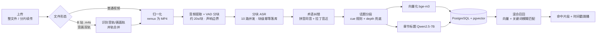

# 课程视频语义检索平台

用自然语言在课程视频里找内容，直接跳到对应时间点播放。

上传一节课程视频 → 自动转写、纠错、按话题分段、向量化入库 → 搜索「三元运算符的格式」→ 返回命中片段与时间戳，点击即在播放器跳转。

面向**个人自托管 / 小团队自建**场景：注册一个账号就是一个独立空间，只看得到、搜得到、播得到、删得掉自己上传的视频，账号之间数据互不可见。不做角色权限、配额与共享资源池。

## 功能亮点

- **端到端可跑**：上传（含 B 站 `.m4s` 双轨识别合并）→ 归一化 → ASR → 术语纠错 → 话题分段 → 向量化 → 检索 → 带时间戳跳播，含 Vue 前端
- **任务不白跑**：ASR 块级落库断点续跑、分布式锁走看门狗、启动时把孤儿任务重新入队。进程被强杀也不从头重跑，不浪费第三方配额
- **大文件上传可续传**：前端按 5MB 切片并行上传，服务端用 Redis 位图记录已收分片；断网或刷新后重选同一批文件只补缺失的片
- **中文术语纠错不靠堆词表**：用拼音匹配把任意同音错写收敛到有限术语表，而不是人工枚举错法（见[设计决策 1](#1-中文纠错不枚举错写改为拼音匹配)）
- **拉丁标识符也按「耳音」纠**：讲师按英文念 Redis/Ctrl/false，ASR 拼成 reice/conttrol/foalse——用预算制对齐 DP 收敛回 Java 标准面（见[设计决策 2](#2-拉丁标识符纠错拼音方案的同构姊妹篇)）
- **数字可复现**：分段 WindowDiff 与检索 Recall@K 都能用离线命令复算，参数注释里写了实验依据，不是「感觉还行」
- **账号之间数据不串**：注册即开独立空间，视频 / 片段 / ASR 断点都带 `tenant_id`，检索 / 列表 / 详情 / 播放 / 删除在数据库层按租户过滤，漏写条件只会查不到（而不是把别人的数据放出去）；连 MD5 去重键都按租户拆分（见[设计决策 7](#7-账号隔离一个用户一个租户)）

## 处理流水线



长耗时阶段（归一化 / ASR / 后处理）全部异步执行，进度通过 SSE 实时推给前端；上传接口只做落盘与内容指纹，立即返回 `taskId`。

## 技术栈

| 层 | 选型 |
| --- | --- |
| 后端 | Spring Boot 3.3.5 / Java 17 / MyBatis-Plus |
| 存储 | PostgreSQL + pgvector（向量）、MinIO（媒体）、Redis（锁与进度） |
| AI | 硅基流动：SenseVoiceSmall（ASR）、bge-m3（embedding）、Qwen2.5-7B（章节标题） |
| 异步 | 本地线程池（默认）或 RocketMQ |
| 前端 | Vue 3 + Vite |

## 快速开始

前置：JDK 17、Maven、Node 18+、Docker、**ffmpeg（需可用，见下）**、硅基流动 API Key。

```bash
# 1. 起基础设施（PostgreSQL + pgvector / MinIO / Redis）
docker compose up -d

# 2. 配置密钥（必填，否则 ASR 与检索不可用）
#    Linux/macOS
export SILICONFLOW_API_KEY=sk-xxxx
#    Windows PowerShell（持久化，重开终端生效）
setx SILICONFLOW_API_KEY "sk-xxxx"

# 3. 起后端（首次启动自动建表，schema 全部 IF NOT EXISTS）
mvn spring-boot:run

# 4. 起前端
cd frontend && npm install && npm run dev
```

打开前端 → 注册一个账号（自动开一个独立空间）→ 上传视频即可。

默认走本地线程池（`vsearch.pipeline.type=local`），**不需要 RocketMQ 也能跑通全链路**。
想改走 MQ：`docker compose up -d rmqnamesrv rmqbroker`，然后
`mvn spring-boot:run "-Dspring-boot.run.arguments=--vsearch.pipeline.type=rocketmq"`。
broker 的 `brokerIP1` 固定在 `docker/rocketmq/broker.conf` 里（默认注册容器内网 IP，
宿主机上的应用拿不到，发送会 `sendDefaultImpl call timeout`）。

> **升级已有数据库**：`video` / `video_segment` / `video_asr_chunk` 会在启动时自动加 `tenant_id` 列，
> 存量行回填到默认租户 `t_default`；旧的全局唯一索引 `uk_video_md5` 会被替换为 `uk_video_tenant_md5`。
> 想看到升级前的视频，需配置 `VSEARCH_DEFAULT_ADMIN_PASSWORD` 后用 `admin` 登录（见[设计决策 7](#7-账号隔离一个用户一个租户)）。

### ffmpeg 配置

默认从 `PATH` 查找 `ffmpeg` / `ffprobe`。若未加入 PATH，用环境变量指定绝对路径：

```bash
setx FFMPEG_PATH  "C:/tools/ffmpeg/bin/ffmpeg.exe"
setx FFPROBE_PATH "C:/tools/ffmpeg/bin/ffprobe.exe"
```

也可以把本机专属配置写在 `application-local.yml`（已在 `.gitignore` 中），用
`mvn spring-boot:run "-Dspring-boot.run.arguments=--spring.profiles.active=local"` 启动。

### 环境变量

| 变量 | 默认值 | 说明 |
| --- | --- | --- |
| `SILICONFLOW_API_KEY` | 无（**必填**） | ASR / embedding / 章节标题 |
| `SILICONFLOW_BASE_URL` | `https://api.siliconflow.cn/v1` | 兼容 OpenAI 协议，可换服务商 |
| `FFMPEG_PATH` / `FFPROBE_PATH` | `ffmpeg` / `ffprobe` | 从 PATH 找 |
| `PG_HOST` / `PG_PORT` / `PG_DB` / `PG_USER` / `PG_PASSWORD` | `localhost` / `5432` / `vsearch` / `vsearch` / `vsearch123` | 与 compose 一致，**默认口令仅供本地开发** |
| `REDIS_HOST` / `REDIS_PORT` | `localhost` / `6379` | |
| `VSEARCH_JWT_SECRET` | 随机生成 | 登录令牌签名密钥。未配置则每次启动随机生成并 WARN——重启即需重新登录，生产环境建议固定 |
| `VSEARCH_DEFAULT_ADMIN_PASSWORD` | 空 | 配了才会创建默认管理员 `admin`（归属 `t_default`，即升级前的存量视频）。不配则不建弱口令，只会 WARN 提示存量视频新注册账号看不到 |

## 上传说明

- 可直接上传**完整视频**（mp4 等），也可上传 **B 站的两个 `.m4s` 分片**，系统按真实流组成自动识别画面轨与声音轨并合并
- 单个 `.m4s` 已同时含画面与声音时直接使用，无需合并；两份都无音轨会明确报错
- 必须有音轨：当前检索链路只依赖音频（视觉检索未实现）
- 同一文件重复上传按 MD5 去重；分片上传与整文件上传共用同一个内容指纹，两条路径互相去重
- 前端默认走分片上传（5MB/片、并行、单片失败重试）；`/upload` 整文件接口保留，供脚本或非浏览器客户端使用

## 接口一览

所有接口挂在 `/api/video` 与 `/api/auth` 下，统一返回 `Result<T>`（`progress` 为 SSE 流除外）。

除 `/api/auth/register`、`/api/auth/login`、`/api/video/play/**`、`/api/video/progress/**` 外，所有 `/api/**` 都要带 `Authorization: Bearer <token>`。播放与进度流带不了请求头，走 `POST /api/video/ticket` 换一张与「租户 + 资源」绑定的短期票据放在 query 里。

| 方法 | 路径 | 说明 |
| --- | --- | --- |
| `POST` | `/api/auth/register` | 注册（开放注册），自动开一个独立空间并返回令牌 |
| `POST` | `/api/auth/login` | 登录，返回令牌（7 天有效） |
| `GET` | `/api/auth/me` | 当前账号，前端用它校验本地令牌是否仍有效 |
| `POST` | `/api/video/ticket` | 用令牌换访问票据（`resourceId` = videoId 或上传期进度 id），换票时即校验归属 |
| `POST` | `/api/video/upload` | 整文件上传（multipart），立即返回 `taskId` |
| `POST` | `/api/video/upload/init` | 分片上传：建会话或复用会话，返回 `uploadId` 与已收分片 |
| `POST` | `/api/video/upload/part` | 分片上传：按序号上传单片，幂等可重传 |
| `POST` | `/api/video/upload/complete` | 分片上传：校验完整性后合并入库 |
| `POST` | `/api/video/search` | 语义检索，返回命中片段与时间戳（只检索本租户） |
| `GET` | `/api/video/progress/{taskId}?ticket=` | SSE 进度流（`text/event-stream`） |
| `GET` | `/api/video/list` | 视频库列表（含状态、时长、片段数、章节骨架） |
| `GET` | `/api/video/{videoId}` | 单个视频详情（含预签名播放地址） |
| `GET` | `/api/video/play/{videoId}?ticket=` | 302 重定向到可播放对象（MinIO 预签名） |
| `DELETE` | `/api/video/{videoId}` | 删除视频及其片段、ASR 块与进度快照 |

实现见 [AuthController](src/main/java/com/course/vsearch/controller/AuthController.java) 与 [VideoController](src/main/java/com/course/vsearch/controller/VideoController.java)。

## 评测数据

样本为 6 个视频 / 19 条边界 / 20 条 QA，全库已于 2026-09-26 用新分段重处理并复测。比例指标附 Wilson 95% 置信区间。

**标注来源（重要）**：仅 v_218ecb10 的 4 条边界与 16 条 QA 为使用者独立标注；其余 5 个视频的 15 条边界、4 条 QA 为开发者按同一协议盲标/自拟，**未经独立复核**，存在自我背书风险。

### 检索

**数字分两层看**：`排名`（Recall@K 走 `searchRawRanking`，绕过闸门，回答「正确片段排第几」）与 `交付`（线上软闸门：高置信 topK 全给；低置信最多给 `low-confidence-limit`=3 条弱展示，回答「用户实际拿不拿得到」）。

| 指标 | n | 排名 Recall（绕闸门） | 95% Wilson CI | 闸门实际交付 |
| --- | --- | --- | --- | --- |
| 全库 Recall@1 | 20 条 / 6 视频 | 75.00%（15/20） | [53.13%, 88.81%] | 同 @1（75%） |
| 全库 Recall@3 / @5 | 20 条 / 6 视频 | 95.00%（19/20） | [76.39%, 99.11%] | **95%（19/20）**：低置信放宽到 3 条后，原被截断的 3 条全部可交付 |
| 片内 Recall@1 | 20 条（限定所属视频） | 85.00%（17/20） | [63.96%, 94.76%] | 同 @1（85%） |
| 片内 Recall@3 / @5 | 20 条 | 100%（20/20） | [83.89%, 100.00%] | **100%（20/20）**：原被截断的 2 条全部可交付 |

分域（排名口径）：课程域 16 条，全库 @1 13/16、@5 15/16（唯一缺口是「IDEA 里格式化代码的快捷键」）；动画域 4 条，全库 @5 4/4。命中样本时间戳偏差 0.0s（`expectedStart` 即答案片段起点）。

### 分段

| 指标 | n（样本规模） | 当前值 | 说明 |
| --- | --- | --- | --- |
| WindowDiff（微平均） | 6 个视频 / 19 条边界 | 0.1492（宏平均 0.1474） | ±20s 容差下命中 18/19，漏切 1、多切 9 |

逐视频（线上策略 `cue@sentence + depth@chunk`，来源前缀 u=使用者标注 / d=开发者盲标）：

| 视频 | 来源 | WindowDiff | ±20s 命中 | 漏切 | 多切 |
| --- | --- | --- | --- | --- | --- |
| v_218ecb10（运算符-05） | u | 0.0206 | 4/4 | 0 | 0 |
| v_e6eef6fb（运算符-08） | d | 0.0042 | 3/3 | 0 | 0 |
| v_f22b4919（for 循环-07） | d | 0.1962 | 3/3 | 0 | 1 |
| v_234e259d（Redis Lua-15） | d | 0.2049 | 4/5 | 1 | 2 |
| v_3efb18f1（继承-04） | d | 0.3989 | 2/2 | 0 | 2 |
| v_1840d2ec（字符串-14） | d | 0.0603 | 2/2 | 0 | 4 |

初版 cue 词表只在 n=1 时好看（WD=0.1568），扩到 6 个视频后暴露为 0.2146——漏切集中在不用那套转场套话的 Redis / 继承两集。改成 HARD（正式话题宣告）+ GATED（设问须 20s 内有收束语）两档后，微平均降到 0.1492、命中 18/19。剩余误差几乎全是 depth 兜底路径的伪边界（9 处多切）；唯一硬漏切在 Redis 150.5s，讲师无任何转场措辞，纯文本信号无解。

### 复现方式

见 [SegmentReplayRunner](src/main/java/com/course/vsearch/evaluation/SegmentReplayRunner.java)：

- `--vsearch.eval.replay-video-id=<videoId>`：读库复算分段（每视频一次 embedding 批量调用，不耗 ASR）
- `--vsearch.eval.replay-correct=true`：复算术语纠错，不耗任何外部配额
- `--vsearch.eval.enabled=true`：输出 WindowDiff + 双层口径检索报告

## 已知局限

故意写在这里——这些都是真实存在的，不是待办清单：

- **没有角色权限**：账号只有「自己的数据」这一种可见域，没有 RBAC、管理员后台、配额与共享资源池；升级前的存量视频统一归属 `t_default`，新注册账号看不到它们
- **检索只走音频**：无音轨的视频无法检索；帧 OCR / CLIP 跨模态未实现
- **全库 Recall@1 75%（CI [53.13%, 88.81%]，n=20）**：片内主流程 @1 85%、@5 排名与交付均 100%；全库交付 @5 95%。低置信放宽到 3 条的代价是：无关查询也会看到 3 条弱结果（均带低置信标记）
- **分段策略不通用**：IDE 演示型课程 WD≤0.20、零漏切；叙事/PPT 型（继承概述 WD 0.40）仍会被 depth 兜底补伪切
- **评测真值的独立性不足**：6 个视频中 5 个的边界、20 条 QA 中 4 条为开发者盲标/自拟，未经复核，绝对数字存在自我背书风险
- **绑定硅基流动**：换服务商需自行改 `SiliconFlowClient`（协议 OpenAI 兼容，改起来不难）
- **中文纠错有两类覆盖不到**：① 同音且错写本身是合法词（如「复制给」→「赋值给」）只能靠短语表；② 单字同音（「为甲」→「为假」）需要 token 边界感知或 LLM 判别，未实现
- **拉丁音近纠错是保守第一版**：明确不碰含数字 token（`K4`←KEYS）、无空格代码黏连（`intI`/`newcancanner`）、全大写按键串（`AR`/`GS`、`Qe`←true）
- **改词表不会自动生效**：已落库片段的正文不会重新纠错，需重新处理视频或自行回填并重算向量
- **依赖 ffmpeg**：系统未安装则无法处理

## 设计决策

### 1. 中文纠错：不枚举错写，改为拼音匹配

ASR 的同音错写变体是无限的——同一节课就有「3元运算符 / 三原运算符 / 三元运算负」多种写法，人工补别名永远追不上。所以改成把文本窗口与**有限的术语表**都转无调拼音做精确匹配：任意未见过的同音错写自动收敛，词表只需维护正确术语本身。

防过杀是这套方案的关键，代价与取舍都写在这里：

- **窗口长度下限 3**：2 字词同音碰撞不可接受（`线程` / `县城` 同音），短词做拼音匹配必然误伤
- **多音字组合数上限 8**：超出即放弃该窗口——宁可漏纠，不可误纠
- **数字按中文读法映射**：`3` → `san`，于是「3元运算符」与「三元运算符」拼音一致
- **拉丁术语不参与拼音匹配**，避免把正常英文单词卷进来

回归验证见 [TerminologyServiceTest](src/test/java/com/course/vsearch/service/correct/TerminologyServiceTest.java)：核心断言用的是**词典里不存在、实测素材里也没出现过**的错写变体（`三源运算符` / `叁元运算符` / `3员运算符`），能纠回就证明能力来自规则而非词条堆砌；另一半断言是防过杀（`复制一行代码`、`重复值为3`、`县城的线程池` 必须原样保留）。

### 2. 拉丁标识符纠错：拼音方案的同构姊妹篇

讲师念英文技术词、ASR 按音节拼拉丁串，错写是**听**出来的：全库取证发现 Redis/Ctrl/Lua/System 的正确形态在 572 个原始 ASR 块里出现 0 次，实际写法是 reice/reis/raice、conttrol/contrl、lu/luva、sstem。问题结构与拼音纠错同构（错写空间开放、正确面有限），但「音近」换成了拉丁语音规则，实现见 [LatinPhoneticMatcher](src/main/java/com/course/vsearch/service/correct/LatinPhoneticMatcher.java)：

- **预算制对齐 DP**：全局只允许 1 次辅音增删（弱读脱落，如 Redis 中间的 d）+ 2 次元音操作（弱听写下 a/e/i 互换）；对齐只接受相同 / 元音互换 / r↔l / c↔s，硬辅音替换、元辅跨界、超预算一律代价无穷。预算卡住了「tamp 靠 3 个廉价辅音缺口漂向 TreeMap」这类泛匹配
- **只折辅音双拼**：conttrol→control、sstem→stem；元音双拼是真实拼写（TreeMap 的 ee），折了就会把目标词改坏——这是踩过的真实 bug
- **同分时缺口位置裁决**：sstem 对 System/Stream 同分（前缀 sy 脱落 vs 中段 tr 插入），按缺口位置和取前缀优先，符合 ASR 错听形态
- **护栏全部由误伤案例反推**：token 与任一正确面精确同形则全局豁免（首版没有它，java 被 JVM 抢改 21 次、false 被 File 抢改 15 次）；停用词在辅音折叠前后各查一次；含数字、内部大写、全大写、2 字母短串各有独立硬门；最终还要对次优候选保持 0.05 margin
- **空格是语音边界**：`conttrol C` 只纠首词、保留单字母尾巴（→ `Ctrl C`）；无空格的 `intI` 不拆，仍归第二版

阈值 0.75（2 字母词 0.9）贴着最难真阳性 raice→Redis 校准。验证分两层：单测 14 个（正样本全部来自语料实测错写，反样本是语料里的合法词/黏连代码）；全库 `replay-correct` 零配额对照，63 条改动逐条人审、首轮 79 条里 20+ 误伤全部转化为护栏回归用例。

### 3. 任务为什么不会因为重启而白跑

开发期改了代码就重启进程，正在跑的 ASR 任务会被强杀，于是出现「状态说在处理、锁却没人持有」的孤儿任务；再传一次文件就从第 0 块重跑，第三方配额白花。三层兜底：

- **块级断点**：`video_asr_chunk` 表 + 唯一索引，每块识别成功即幂等落库；复用前校验起止时间（容差 0.05s），防止 VAD 边界漂移导致时间戳错配
- **看门狗锁**：`tryLock(0, TimeUnit.SECONDS)`，进程存活则锁自动续约；被强杀后 ≤30s 释放
- **启动自愈**：扫描「状态为 PENDING/PROCESSING 但锁空闲」的任务重新入队，复用断点续跑

前端另有一层感知：SSE 静默超时后反查任务状态，服务端已死则显示「任务已中断」，不让进度条一直干等。

### 4. 参数不拍脑袋

配置文件的注释里保留了实验数据。举两个例子：

- `asr-concurrency`：5 路 → 约 4.95 倍线性加速；翻到 10 路 → 只剩约 1.46 倍。单请求延迟没随并发上升，说明瓶颈在服务端整体吞吐，继续上调收益有限且更容易撞超时，所以停在 10 路
- `response-timeout-seconds`：120s / 180s 两组对比跑下来，**两次配置完全相同的结果却差 1.46 倍**——说明运行间波动（约 140s）远大于超时值本身的影响（约 14s）。所以不要指望调这个参数提速；保留 180s 是因为确实存在合法耗时 >120s 的块，120s 会误杀它们并触发重试

### 5. 异步流水线：本地线程池 vs RocketMQ（实测）

两条实现都只做一件事——把「耗时分钟级的处理」从 HTTP 线程挪走：`local` 投本机线程池，`rocketmq` 发消息由消费者拉取。同一批 20 秒素材、同一台机器上的实测：

| 指标 | 本地线程池 | RocketMQ |
| --- | --- | --- |
| 上传接口响应 | 0.02 ~ 0.18 s | 0.03 ~ 0.20 s |
| 提交 → 开始处理 | 0.204 s / 0.184 s | 0.182 s（消费者已就绪） |
| 同上，应用刚启动时 | — | 21.29 s（消费者首次 rebalance） |
| 单任务端到端 | ~1.2 s（ASR 主导） | ~1.2 s（ASR 主导） |

结论是诚实的：**单机单实例下 MQ 不带来性能收益**。真正的成本是应用启动后第一次拉取的 rebalance（20 s 级），而且一旦某个任务卡在 ASR，后面的消息就排在消费线程后面——和本地线程池排队是同一回事。MQ 换来的是解耦与可扩展：服务可以多实例（同一消费组自动分摊）、消息在 broker 落盘（进程崩了任务不丢）、重试与堆积有现成手段。它是**可选**实现，默认仍是 `local`。

多实例消费同一个 topic 时，任务级并发不再受单进程 `local-threads` 限制；但块级 ASR 并发（`asr-concurrency`）与第三方配额是按实例算的，多实例会把总并发乘上去（全局限流走 Redis 令牌桶，是跨实例的）。

### 6. 分片上传与上传断点续传（实测）

整文件一次 POST 的问题不是「慢」，是**代价不可分摊**：传到 90% 断线，重连后那 90% 全部作废；308MB 的文件也没有任何进度可看。三段式接口（`/upload/init` → `/upload/part` → `/upload/complete`）把它拆开：

- **会话与断点**：客户端用「文件名 + 大小 + 修改时间」算出 `sessionKey`（[api.js](frontend/src/api.js)），服务端据此复用或新建会话，`init` 响应带回 `receivedParts`——这就是断点：刷新页面或断网后重选同一批文件，只会补缺失的片。分片状态存 Redis 位图（`RBitSet`），元数据存 `RMap`，会话 24h 过期
- **单片幂等**：每片按序号独立落盘，重传直接覆盖；落盘长度与期望不符的片**就地删除且不记入位图**，坏片不会带着错误长度混进合并结果
- **合并口径与单次上传一致**：按序拼接时用 `DigestOutputStream` 同一遍算 MD5，故分片上传与整文件上传得到同一个内容指纹，共用同一把上传锁与同一条入库路径（[VideoAppService#submitSpooled](src/main/java/com/course/vsearch/service/VideoAppService.java)）
- **先校验后合并**：缺片直接 409 并列出缺失片号，不会把半成品放进流水线（失败落在归一化阶段更难排查）

实测（同一台机器，`--vsearch.pipeline.type=local`）：

| 场景 | 输入 | 结果 |
| --- | --- | --- |
| 小文件分片 | 607863 B / chunk 256KB → 3 片 | 传 1、2 片后重连 init：`resumed=true, receivedParts=[1,2]` |
| 缺片提交 | 同上，缺第 3 片 | `409 分片不完整：文件 0 缺少 1 片（[3]）` |
| 坏片 | 第 3 片只发 100 B | `400 分片大小不符：期望 83575 字节，实际 100`，坏片被删除 |
| 大文件 | 322991649 B（308MB）/ chunk 64MB → 5 片 | 2×64MB 上传 16s；重连 `resumed=true, received=1,2` |
| 合并正确性 | 22MB / 5 片（浏览器真实链路） | 合并后 `md5 fc6c0e128d5c40525219c24d768ebfcb` == 源文件 MD5（逐字节一致） |
| 跨路径去重 | 同一文件先走 `/upload`，再分片全量重传 | 两次都 `duplicated=true` 且返回同一 taskId（两条路径指纹一致） |
| 客户端续传 | 预置第 1 片后从浏览器上传 | 后端日志 `分片上传会话复用`（已收 1 片） |

诚实结论与 §5 一致：**分片上传不等于更快**。串行分片受上行带宽限制甚至略慢；并行对总时长帮助有限，它的真实价值是「单请求失败的代价从整个文件降到几 MB」+「按服务端已确认分片数给出精确进度」+ 断点续传。

### 7. 账号隔离：一个用户一个租户

用词先说清：这里的「多租户」不是 SaaS 那套租户管理，而是**每个账号只能看到、搜到、播到、删掉自己上传的视频**。一个用户 = 一个租户，`tenant_id` 就是数据归属边界。

- **共享表 + 拦截器自动过滤**：`video` / `video_segment` / `video_asr_chunk` 三张表各加一列 `tenant_id`，MyBatis-Plus 的 `TenantLineInnerInterceptor` 给每条 SQL 自动补条件，故「按 videoId 查片段」「全库列表」这些既有语句一行都不用改，将来新加的查询也不会因为忘写条件而漏数据
- **失败关闭，而不是失败放开**：拿不到租户上下文时 `getTenantId()` 返回空串，条件恒不成立——表现是「查不到数据」并立刻暴露，而不是「不带条件」把别人的数据放出去
- **MD5 去重键必须按租户拆**：原先 `uk_video_md5` 是全局唯一，B 上传 A 传过的同一份文件会直接命中 A 的记录、拿到 A 的 videoId，这就是最实在的一处串台。改成 `(tenant_id, md5)` 唯一后，去重只在账号内生效
- **三处「自动不了」的地方显式收口**：① 后台线程（上传预处理池 / 处理流水线 / MQ 消费者 / 启动自愈）没有请求上下文，入口处显式 `TenantContext.runAsSystem`，租户值由它们自己写库；② SSE 进度流与 `<video>` 播放带不了请求头，用 `POST /api/video/ticket` 换一张与「租户 + 资源」绑定的短期票据放在 query，换票时即完成归属校验；③ 归属校验一律显式带租户查询（`selectByVideoIdAndTenant`）而不是依赖拦截器——持票通道没有上下文，拦截器只会注入空条件
- **升级存量数据不改索引语义**：`ADD COLUMN IF NOT EXISTS` → `UPDATE ... WHERE IS NULL` → `SET NOT NULL` 三段式，刻意不给 DEFAULT——开发期漏写 `tenant_id` 应该直接撞非空约束报错，而不是静默落进默认租户

**已知取舍**：票据有效期 2 小时（与播放用的预签名 URL 对齐，`<video>` 播放期间会持续发 Range 请求，票据中途过期会让播放卡死），故票据泄漏的暴露面与预签名 URL 同一量级，靠「资源绑定 + 换票时校验归属」收敛。令牌密钥未配 `VSEARCH_JWT_SECRET` 时随机生成，重启即需重新登录。

## 目录结构

```
src/main/java/com/course/vsearch/
├─ service/pipeline/   上传与处理流水线（归一化 / 双轨合并 / ASR / 纠错 / 分段 / 向量化）
├─ service/            上传入口与检索（VideoAppService / SearchService）
├─ service/ai/         硅基流动客户端（ASR / embedding / chat）
├─ service/audio/      音频提取与 VAD 分块
├─ service/correct/    术语纠错（五条规则 + 拼音匹配）
├─ service/segment/    话题分段（fixed / semantic / acoustic）
├─ service/lock/       分布式锁（看门狗续约、存活探针）
├─ service/progress/   进度快照与 SSE 推送
├─ service/storage/    MinIO 读写
├─ security/           登录令牌、租户上下文与访问票据（JwtService / TenantContext / AccessTicketService）
├─ evaluation/         离线复算与评测
└─ controller/         HTTP 接口
src/main/resources/dictionary/tech-terms.json   术语表
src/main/resources/eval/                        真值边界与检索 QA
frontend/src/                                   Vue 前端
```

## 后续方向

以下是当前**未实现**、但架构上已经预留了入口的方向：

- **多模态检索**：现在只索引音频文本，画面信息完全没进检索。两条可选路径——**关键帧 OCR**（把 IDE 里的代码、PPT 文字抽出来并入索引，直接解决「IDEA 快捷键」这类按键噪声问法）与 **CLIP 跨模态**（图文同空间，支持「那个红色报错界面」这类以画面为线索的提问）。两者都能复用现有的分段、向量化与 pgvector 混合召回链路，只需新增一路召回源
- **入向限流**：现有令牌桶只控出向调用（保护第三方配额），可按 IP / 会话补一层接口频次限制
- **评测真值复核**：6 个视频中 5 个的边界为开发者盲标，需独立复核（见「已知局限」）

## License

MIT